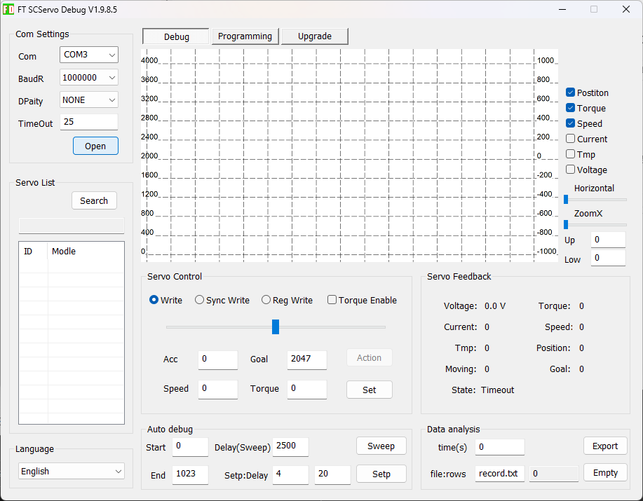
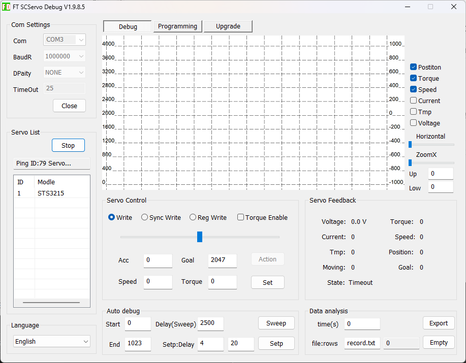
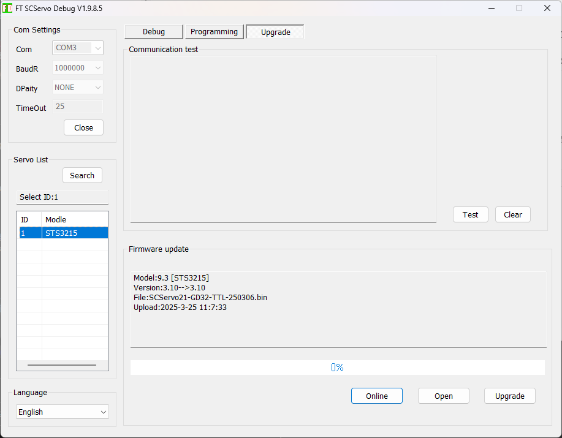
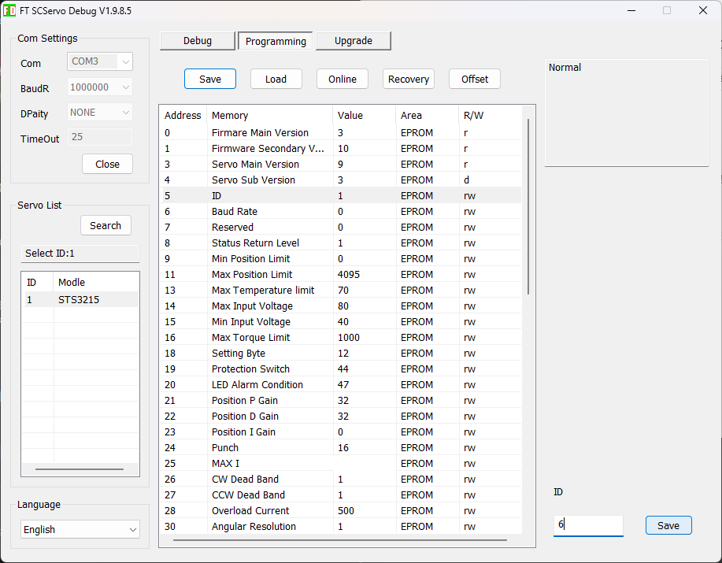

# SO-101 セットアップ手順（Windows）

このドキュメントは、LeRobotフレームワークのSO-101ロボットアームをWindows環境でセットアップする手順をまとめたものです。

## 環境

- OS: Windows (ネイティブ、WSL2不使用)
- Shell: PowerShell
- Python: 3.12-3.13
- パッケージ管理: uv
- 動画処理: FFmpeg

## セットアップ手順

### 1. ツールのインストール

#### uv のインストール

```powershell
powershell -ExecutionPolicy Bypass -c "irm https://astral.sh/uv/install.ps1 | iex"
```

#### FFmpeg のインストール

```powershell
winget install --id=Gyan.FFmpeg -e
```

### 2. pyproject.toml の作成

プロジェクトルートに以下の内容で `pyproject.toml` を作成します：

```toml
[project]
name = "sandbox-so101-win"
version = "0.1.0"
description = "Add your description here"
readme = "README.md"
requires-python = ">=3.12, <3.14"
dependencies = [
    "lerobot",
    "lerobot[feetech]",
    "opencv-python>=4.12.0.88",
    "torch>=2.7.*, <2.8.0",
]

[tool.uv.sources]
torch = { index = "torch-cu128" }
lerobot = { git = "https://github.com/huggingface/lerobot", branch = "main" }

[[tool.uv.index]]
name = "torch-cu128"
url = "https://download.pytorch.org/whl/cu128"
explicit = true
```

### 3. 依存関係のインストール

Git LFSのエラーを回避するため、以下のコマンドで依存関係をインストールします：

```powershell
powershell -Command "[Environment]::SetEnvironmentVariable('GIT_LFS_SKIP_SMUDGE', '1', 'Process'); uv sync"
```

### 4. サーボモーターのファームウェア更新とID設定

サーボモーター内蔵マイコンのファームウェアが古いと動作に問題が発生する可能性があるため、更新を行います。

#### 設定ツールのダウンロード

**Feetech公式ホストコンピュータソフトウェア（Windowsシステム用）** をダウンロードします。

- **注意**: 2025年6月30日より前に購入したユーザーは、公式コードとサーボメーカーのファームウェア更新のため、必ずこのソフトウェアをダウンロードしてファームウェアを更新してください
- 参考: [Seeed Studio Wiki - LeRobot SO-100M](https://wiki.seeedstudio.com/lerobot_so100m/)

#### ファームウェア更新とモーターID設定

⚠️ **注意**: LeRobotのPythonスクリプトではID設定がEEPROMに保存されません。必ずFeetech公式ソフトウェア（FD.exe）を使用してください。

1. **サーボモーターの接続**

   - 1台のモーターのみを接続し、電源を入れる
2. **ポート設定と検出**

   - 対応するPort Numberを選択
   - Baudrate: **1000000** に設定
   - **Open** をクリック  
   
   - **Search** をクリックしてすべてのサーボを検出  
     
3. **ファームウェアの更新**

   - すべてのサーボが検出されたことを確認
   - **Upgrade** をクリック  
     
   - **Online** を実行
      成功のポップアップを確認
   - **Upgrade** を実行  
     
   - ファームウェアバージョンが **3.9** から **3.10** に更新されていることを確認
4. **IDを変更**

   - **Programming** タブを選択
   - **ID** を選択
   - 右下に表示される設定値を変更（1→2, 1→3, など）
   - **Save** ボタンをクリック
   - **重要**: Saveをクリックすることで、IDがEEPROMに保存されます  
     
5. **次のモーターへ**

   - モーターを外し、次のモーターを接続
   - 同じ手順でID 2, 3, 4, 5, 6と設定
6. **リーダーアームとフォロワーアーム**

   - リーダーアーム: L1～L6（ID 1～6）
   - フォロワーアーム: F1～F6（ID 1～6）
   - 両方のアームのモーター各6個をそれぞれ設定

### 5. 組み立て

モーターIDの設定が完了したら、ロボットアームを組み立てます。

#### 組み立て手順

詳細な組み立て手順については、以下のサイトを参考にしてください：

**参考記事:**
- [SO-101のセットアップ（組み立て）](https://note.com/npaka/n/n8424d322ebd4)

#### 組み立て時の注意点

- **モーターIDの確認**: 組み立て前に各モーターのIDが正しく設定されていることを確認してください
- **配線**: モーターをデイジーチェーン接続する際は、配線の順序に注意してください（モーターコネクタ2か所のどちらに接続しても大丈夫そうです）
- **電源**: 組み立て中は電源をOFFにしてください
- **トルク**: 組み立て完了後、キャリブレーション前にトルクがOFFになっていることを確認してください

---

### 6. キャリブレーション

SO-ARM101のサーボキャリブレーションと初期化のプロセスは、SO-ARM100と同じですが、リーダーアームの最初の3つのジョイントのギア比が異なるため、慎重に区別してキャリブレーションを行う必要があります。

#### 前提条件

- **リーダーアーム**: モーター6個（L1～L6）のIDを1～6に設定済み
- **フォロワーアーム**: モーター6個（F1～F6）のIDを1～6に設定済み
- 両方のアームがバスサーボアダプターに接続され、電源とUSBが接続されている

#### サーボモデルとギア比の対応表

| サーボモデル                                  | ギア比 | 対応するジョイント |
| --------------------------------------------- | ------ | ------------------ |
| ST-3215-C044 (7.4V)                           | 1:191  | L1                 |
| ST-3215-C001 (7.4V)                           | 1:345  | L2                 |
| ST-3215-C044 (7.4V)                           | 1:191  | L3                 |
| ST-3215-C046 (7.4V)                           | 1:147  | L4～L6             |
| ST-3215-C001 (7.4V) / C018 (12V) / C047 (12V) | 1:345  | F1～F6             |

#### ⚠️ 電源接続の注意

- **STS3215 7.4Vモーター**: 5V電源を使用
- **STS3215 12Vモーター**: 12V電源を使用
- **リーダーアーム**: 常に7.4Vモーター（5V電源）を使用
- ⚠️ **重要**: 誤った電源を接続するとモーターが焼損する可能性があります
- USBからは電力が供給されないため、電源とUSBの両方を接続する必要があります

#### USBポートの識別

各アームの正しいポートを見つけるには、ユーティリティスクリプトを2回実行します：

```powershell
.venv\Scripts\Activate.ps1
python -m lerobot.scripts.lerobot_find_port
```

**実行手順:**
1. スクリプトを実行すると、現在接続されているポートが表示されます
2. 「Remove the USB cable from your MotorsBus and press Enter when done.」というメッセージが表示されます
3. 確認したいアームのUSBケーブルを抜いてEnterを押します
4. スクリプトが、どのポートが消えたかを教えてくれます
5. USBケーブルを再接続します

**または、Windowsのデバイスマネージャーで確認:**
1. Windowsキー + X → デバイスマネージャー
2. 「ポート（COMとLPT）」を展開
3. 「USB Serial Device (COMx)」を確認

**出力例:**
- **リーダーアーム**: `COM3` (Windows) / `/dev/tty.usbmodem575E0031751` (Mac) / `/dev/ttyACM0` (Linux)
- **フォロワーアーム**: `COM4` (Windows) / `/dev/tty.usbmodem575E0032081` (Mac) / `/dev/ttyACM1` (Linux)

**トラブルシューティング (Linux)**: USBポートへのアクセス許可が必要な場合：

```bash
sudo chmod 666 /dev/ttyACM0
sudo chmod 666 /dev/ttyACM1
```

#### キャリブレーション手順

⚠️ **電源の注意**:

- **リーダーモーター** (ST-3215-C046, C044, 001): **5V電源**を使用
- **フォロワーモーター** (アームキット版 ST-3215-C001): **5V電源**を使用
- **フォロワーモーター** (アームキットPro版 ST-3215-C047/C018): **12V電源**を使用

**キャリブレーション時の位置参考画像**:
各ジョイントを図1～図6の位置に合わせてキャリブレーションを行います。詳細は[Seeed Studio Wiki](https://wiki.seeedstudio.com/lerobot_so100m/)の画像を参照してください。

---

#### 1. リーダーアームのキャリブレーション

**前提条件:**

- リーダーアームの6つのモーター（L1～L6）のIDが1～6に設定済み
- すべてのモーターがバスサーボアダプターにデイジーチェーン接続されている
- 5V電源とUSBケーブルが接続されている
- 電源がONになっている

**実行コマンド:**

PowerShellを開き、以下のコマンドを実行します：

```powershell
.venv\Scripts\Activate.ps1
python -m lerobot.scripts.lerobot_calibrate --teleop.type=so101_leader --teleop.port=COM3 --teleop.id=my_awesome_leader_arm
```

**手順:**

1. **接続確認**

   - スクリプトが起動し、以下のようなメッセージが表示されます：

   ```
   INFO my_awesome_leader_arm SO101Leader connected.
   Running calibration of my_awesome_leader_arm SO101Leader
   ```
2. **中央位置（Middle）への移動**

   - 次のメッセージが表示されます：

   ```
   Move my_awesome_leader_arm SO101Leader to the middle of its range of motion and press ENTER....
   ```

   - **アームを手で持って、すべてのジョイントを可動範囲の中央位置に移動**させます
   - 中央位置は、各ジョイントが最大/最小位置の中間にある状態です

   

   - 位置が決まったら **Enterキーを押します**
3. **可動範囲の測定**

   - 次のメッセージが表示されます：

   ```
   Move all joints sequentially through their entire ranges of motion.
   Recording positions. Press ENTER to stop...
   ```

   - **すべてのジョイントを順番に可動範囲いっぱいまで動かします**
   - 各ジョイント（1～6）を最小位置から最大位置まで動かします
   - すべてのジョイントの可動範囲を動かし終えたら **Enterキーを押します**
   - スクリプトが自動的に各ジョイントの可動範囲を記録します
4. **キャリブレーション完了**

   - すべてのジョイントの測定が完了すると、キャリブレーションデータが保存されます
   - 保存先: `.cache/calibration/my_awesome_leader_arm.json`

---

#### 2. フォロワーアームのキャリブレーション

**前提条件:**

- フォロワーアームの6つのモーター（F1～F6）のIDが1～6に設定済み
- すべてのモーターがバスサーボアダプターにデイジーチェーン接続されている
- 適切な電源（5Vまたは12V）とUSBケーブルが接続されている
- 電源がONになっている

**実行コマンド:**

PowerShellを開き、以下のコマンドを実行します：

```powershell
.venv\Scripts\Activate.ps1
python -m lerobot.scripts.lerobot_calibrate --robot.type=so101_follower --robot.port=COM4 --robot.id=my_awesome_follower_arm
```

> **注**: `COM4` はフォロワーアームのポート番号です。環境に応じて変更してください。

**手順:**

リーダーアームと同じ手順でキャリブレーションを実行します：

1. **接続確認**: スクリプトが起動し、接続メッセージが表示されます
2. **中央位置への移動**: アームを可動範囲の中央に移動 → **Enterキー**
3. **可動範囲の測定**: すべてのジョイント（1～6）を順番に最小～最大まで動かす → **Enterキー**
4. **キャリブレーション完了**: データが保存されます

---

#### キャリブレーション完了後

**確認事項:**

- キャリブレーションファイルが生成されていることを確認
  - リーダーアーム: `.cache/calibration/my_awesome_leader_arm.json`
  - フォロワーアーム: `.cache/calibration/my_awesome_follower_arm.json`

**注意:**

- モーターの値は0～4096（1回転分）で、2048が中央値です
- ホーミングオフセットは0に設定されており、組み立てミスがあった場合でも±2048ステップ（±180度）まで調整可能です
- キャリブレーションは、アームの組み立て後に必ず実行してください
- キャリブレーションデータは、テレオペレーションやデータ収集時に使用されます

**参考**: SO-ARM100サーボキャリブレーションビデオも参照できますが、サーボジョイントIDとギア比がSO-ARM101のものと厳密に一致していることを確認してください。

---

### 7. 再キャリブレーション

アームを再キャリブレーションする必要がある場合（アームの組み立て直しやキャリブレーションミスなど）は、以下の手順で実行します。

#### キャリブレーションファイルの削除

再キャリブレーションを行う前に、既存のキャリブレーションファイルを削除する必要があります。

**キャリブレーションファイルの場所:**

- リーダーアーム: `C:\Users\<ユーザー名>\.cache\huggingface\lerobot\calibration\teleoperators\so101_leader\my_awesome_leader_arm.json`
- フォロワーアーム: `C:\Users\<ユーザー名>\.cache\huggingface\lerobot\calibration\robots\so101_follower\my_awesome_follower_arm.json`

**削除方法:**

PowerShellで以下のコマンドを実行：

```powershell
# リーダーアームのキャリブレーションファイルを削除
Remove-Item "$env:USERPROFILE\.cache\huggingface\lerobot\calibration\teleoperators\so101_leader\my_awesome_leader_arm.json" -ErrorAction SilentlyContinue

# フォロワーアームのキャリブレーションファイルを削除
Remove-Item "$env:USERPROFILE\.cache\huggingface\lerobot\calibration\robots\so101_follower\my_awesome_follower_arm.json" -ErrorAction SilentlyContinue
```

#### 再キャリブレーションの実行

キャリブレーションファイル削除後、上記の「6. キャリブレーション」セクションの手順に従ってキャリブレーションを実行します。

**リーダーアーム:**

```powershell
.venv\Scripts\Activate.ps1
python -m lerobot.scripts.lerobot_calibrate --teleop.type=so101_leader --teleop.port=COM3 --teleop.id=my_awesome_leader_arm
```

実行時に以下のメッセージが表示されます：

```
Press ENTER to use provided calibration file associated with the id my_awesome_leader_arm, or type 'c' and press ENTER to run calibration:
```

- キャリブレーションファイルを削除していない場合は、**「c」と入力してEnter**を押すと新規キャリブレーションを実行できます
- キャリブレーションファイルを削除済みの場合は、自動的にキャリブレーションが開始されます

**フォロワーアーム:**

```powershell
.venv\Scripts\Activate.ps1
python -m lerobot.scripts.lerobot_calibrate --robot.type=so101_follower --robot.port=COM4 --robot.id=my_awesome_follower_arm
```

#### ⚠️ キャリブレーション時の注意事項

**トルクの挙動:**

- キャリブレーションスクリプトを実行すると、最初はトルクがOFFになり、手でアームを動かせる状態になります
- キャリブレーション完了後、`configure()`メソッドが自動実行され、**トルクがONになります**
- これは正常な挙動です

**トルクがONのままキャリブレーションが開始された場合:**

もし何らかの理由でトルクがONのままキャリブレーションが開始され、アームを動かせない場合は、以下のスクリプトを使ってトルクをOFFにできます：

```powershell
# リーダーアームのトルクをOFF
python scripts\disable_torque.py --type leader --port COM3

# フォロワーアームのトルクをOFF
python scripts\disable_torque.py --type follower --port COM4
```

トルクをOFFにした後、再度キャリブレーションスクリプトを実行してください。

---

### 8. アーム動作テスト

キャリブレーション完了後、以下のテストスクリプトでアームの動作を確認できます。

#### アーム位置の確認

アームの各ジョイント位置をリアルタイムで表示します（トルクOFF状態）。

**フォロワーアームの位置確認:**

```powershell
.venv\Scripts\Activate.ps1
python scripts\test_follower_arm.py
```

- キャリブレーション済みの場合、正規化された位置（度数/パーセント）が表示されます
- キャリブレーション時の中央位置が約0度として表示されます
- 手でアームを動かしながら各ジョイントの角度を確認できます
- Ctrl+Cで終了

**オプション:**

```powershell
# カスタムポート/IDで実行
python scripts\test_follower_arm.py --port COM4 --id my_awesome_follower_arm
```

**リーダーアームの位置確認:**

```powershell
python scripts\test_leader_arm.py --port COM3
```

#### 0ポジション（中央位置）への移動

アームを0ポジション（キャリブレーション時の中央位置）へ自動的に移動します。

**リーダーアームを0ポジションへ移動:**

```powershell
.venv\Scripts\Activate.ps1
python scripts\move_to_zero.py --type leader
```

**フォロワーアームを0ポジションへ移動:**

```powershell
.venv\Scripts\Activate.ps1
python scripts\move_to_zero.py --type follower
```

**オプション:**

```powershell
# 移動速度を変更（1-100%、デフォルト: 10）
python scripts\move_to_zero.py --type follower --speed 20

# カスタムポート/ID
python scripts\move_to_zero.py --type follower --port COM4 --id my_awesome_follower_arm --speed 15
```

**動作の流れ:**

1. すべてのモーターのトルクをOFFにする
2. 1軸目（shoulder_pan）のみトルクON → 0ポジションへ移動
3. 2軸目（shoulder_lift）のみトルクON → 0ポジションへ移動（1軸目はトルクONのまま保持）
4. 以下同様に6軸まで順番に移動
5. すべてのジョイントが0ポジションに到達
6. Enterキーを押すとトルクをOFFにして終了

**注意:**

- 移動中、まだ動いていないモーターはトルクOFFでフリー状態になります（干渉防止）
- 移動完了後、すべてのモーターはトルクONで0ポジションを保持します
- デフォルト速度は10%（超低速）です

#### トルクの手動制御

必要に応じて、トルクを手動でON/OFFできます。

**トルクをOFFにする:**

```powershell
# リーダーアーム
python scripts\disable_torque.py --type leader --port COM3

# フォロワーアーム
python scripts\disable_torque.py --type follower --port COM4
```

**詳細:**
各スクリプトの詳しい使い方は、[scripts/README.md](scripts/README.md) を参照してください。

---

### 9. テレオペレーション（リーダーアームでフォロワーアームを操作）

キャリブレーション完了後、リーダーアームを動かしてフォロワーアームをリアルタイムで制御できます。

#### 前提条件

- リーダーアームとフォロワーアームの両方がキャリブレーション済み
- 両方のアームが電源とUSBに接続されている
- 適切なCOMポートが確認済み（リーダー: COM3、フォロワー: COM4）

#### テレオペレーションの実行

**基本的な実行方法（カメラなし）:**

```powershell
.venv\Scripts\Activate.ps1
python -m lerobot.scripts.lerobot_teleoperate `
  --robot.type=so101_follower `
  --robot.port=COM4 `
  --robot.id=my_awesome_follower_arm `
  --robot.cameras='{}' `
  --teleop.type=so101_leader `
  --teleop.port=COM3 `
  --teleop.id=my_awesome_leader_arm `
  --display_data=false
```

**パラメータの説明:**

- `--robot.type=so101_follower`: フォロワーアーム（制御される側）のタイプ
- `--robot.port=COM4`: フォロワーアームのCOMポート
- `--robot.id=my_awesome_follower_arm`: フォロワーアームのキャリブレーションID
- `--robot.cameras='{}'`: カメラなし（空の辞書）
- `--teleop.type=so101_leader`: リーダーアーム（操作する側）のタイプ
- `--teleop.port=COM3`: リーダーアームのCOMポート
- `--teleop.id=my_awesome_leader_arm`: リーダーアームのキャリブレーションID
- `--display_data=false`: データ可視化を無効化

#### カメラを使用する場合

カメラを追加してデータ可視化を有効にする場合：

```powershell
python -m lerobot.scripts.lerobot_teleoperate `
  --robot.type=so101_follower `
  --robot.port=COM4 `
  --robot.id=my_awesome_follower_arm `
  --robot.cameras='{ front: {type: opencv, index_or_path: 0, width: 1920, height: 1080, fps: 30}}' `
  --teleop.type=so101_leader `
  --teleop.port=COM3 `
  --teleop.id=my_awesome_leader_arm `
  --display_data=true
```

**カメラパラメータ:**

- `front`: カメラ名（任意の名前）
- `type: opencv`: OpenCVカメラを使用
- `index_or_path: 0`: カメラのインデックス（0, 1, 2...）またはパス
- `width`, `height`: 解像度
- `fps`: フレームレート

**複数のカメラを使用する場合:**

```powershell
--robot.cameras='{
  front: {type: opencv, index_or_path: 0, width: 1920, height: 1080, fps: 30},
  top: {type: opencv, index_or_path: 1, width: 1920, height: 1080, fps: 30}
}'
```

#### 動作確認

1. スクリプトを実行すると、両方のアームに接続されます
2. リーダーアームを手で動かすと、フォロワーアームが同じ動きをします
3. Ctrl+Cで終了します

#### トラブルシューティング

**エラー: ポートが見つからない**

- COMポートが正しいか確認してください
- デバイスマネージャーでUSBシリアルポートを確認

**エラー: キャリブレーションファイルが見つからない**

- 両方のアームのキャリブレーションが完了しているか確認
- キャリブレーションファイルのパスを確認：
  - リーダー: `C:\Users\<ユーザー名>\.cache\huggingface\lerobot\calibration\teleoperators\so101_leader\my_awesome_leader_arm.json`
  - フォロワー: `C:\Users\<ユーザー名>\.cache\huggingface\lerobot\calibration\robots\so101_follower\my_awesome_follower_arm.json`

**動作が遅い/カクカクする**

- カメラの解像度やfpsを下げてみてください
- `--display_data=false`でデータ可視化を無効化してみてください

---

### 10. キャリブレーションデータの確認

キャリブレーションファイルには、以下の情報が記録されています：

```json
{
    "shoulder_pan": {
        "id": 1,
        "drive_mode": 0,
        "homing_offset": -1451,
        "range_min": 774,
        "range_max": 3485
    },
    ...
}
```

**各パラメータの意味:**

- `id`: モーターID（1～6）
- `drive_mode`: 回転方向（0=正転、1=反転）
- `homing_offset`: キャリブレーション時の中央位置をエンコーダ中央値（2047付近）に調整するオフセット
- `range_min`: 可動範囲の最小値（エンコーダ値）
- `range_max`: 可動範囲の最大値（エンコーダ値）

**正規化の仕組み:**

- エンコーダ値（0～4095）をキャリブレーションデータで正規化
- 度数モード: 中央位置を0度として、可動範囲を±角度で表現
- パーセントモード（gripper）: 最小=0%、最大=100%

## 注意点

- Python 3.14は現在torchが未対応のため、3.12-3.13を使用
- Git LFSのリモートオブジェクトエラーが発生する場合は、`GIT_LFS_SKIP_SMUDGE=1`を設定してインストール
- opencv-pythonは明示的に追加（uv経由のインストールで必要）
- WSL2経由のUSBパススルーはレイテンシの問題があるため非推奨

## インストールされるパッケージ

- lerobot: LeRobotフレームワーク本体
- torch: PyTorch (CUDA 12.8対応)
- torchvision: 画像処理
- opencv-python: コンピュータビジョン
- feetech-servo-sdk: Feetechサーボモーター制御
- rerun-sdk: データ可視化
- その他、90以上の依存パッケージ

## 次のステップ

セットアップ完了後は、以下のコマンドで仮想環境を有効化して作業を開始できます：

```powershell
.venv\Scripts\Activate.ps1
```

## 参考

- 元記事: https://zenn.dev/komination/articles/464cb07be1b77f
- LeRobot公式: https://github.com/huggingface/lerobot
